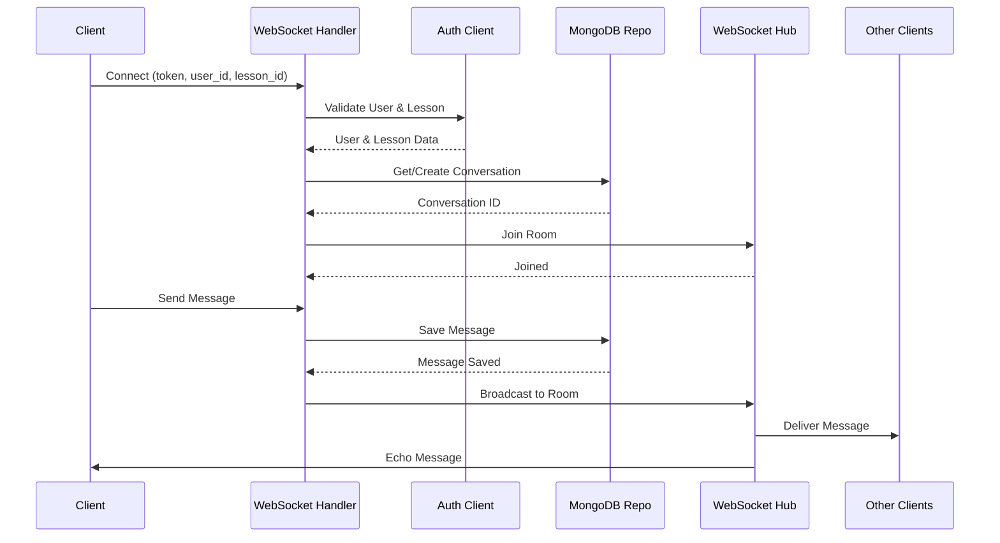

<div align="center">

# 💬 Edu-NeoSoft Chat Service


**A high-performance real-time chat microservice for educational platforms**

Built with Go • Powered by WebSocket • Stored in MongoDB

[Features](#-features) • [Architecture](#-architecture) • [API Documentation](#-api-documentation) • [Deployment](#-deployment)

</div>

---

## 📋 Table of Contents

- [Overview](#-overview)
- [Features](#-features)
- [Architecture](#-architecture)
- [Tech Stack](#-tech-stack)
- [Project Structure](#-project-structure)
- [Getting Started](#-getting-started)
- [API Documentation](#-api-documentation)
- [WebSocket Protocol](#-websocket-protocol)
- [Deployment](#-deployment)
- [Configuration](#-configuration)

---

## 🎯 Overview

Edu-NeoSoft Chat Service is a production-ready real-time messaging microservice designed for educational platforms. It enables seamless communication between mentors and students within the context of specific lessons, with built-in authentication, presence tracking, and message persistence.

### Key Capabilities

- 🔐 **JWT Authentication** via Django backend integration
- 💬 **Real-time messaging** with WebSocket connections
- 👥 **Role-based access control** (Mentor/Student)
- 📚 **Lesson-scoped conversations** for organized communication
- ✅ **Read receipts** and typing indicators
- 📊 **Presence tracking** (online/offline status)
- 💾 **Message persistence** in MongoDB

---

## ✨ Features

### 🔐 Authentication & Authorization

- **JWT Token Validation**: All requests validated against Django backend
- **Role-Based Access**: 
  - Mentors can initiate chats with any student in their lessons
  - Students can only access their own conversations
- **Lesson Validation**: Ensures users can only chat within authorized lessons

### 💬 Real-Time Communication

- **WebSocket Hub**: Scalable connection management with room-based broadcasting
- **Message Broadcasting**: Instant delivery to all participants in a conversation
- **Typing Indicators**: Real-time typing status updates
- **Read Receipts**: Track message view status
- **Presence System**: Monitor user online/offline status

### 📦 Data Management

- **Conversation Management**: Auto-create unique conversations per lesson/mentor/student
- **Message Persistence**: All messages stored in MongoDB with timestamps
- **Indexed Queries**: Optimized database queries with unique indexes
- **Message History**: Full conversation history retrieval via REST API

---

## 🏗 Architecture

### System Architecture Diagram

```mermaid
graph TB
    subgraph "Client Layer"
        WEB[Web Client]
        MOBILE[Mobile App]
    end
    
    subgraph "Chat Service"
        WS[WebSocket Handler<br/>/ws]
        REST[REST API<br/>/messages, /conversations]
        HUB[WebSocket Hub<br/>Room Management]
        AUTH[Auth Client<br/>Django Integration]
        REPO[MongoDB Repository]
    end
    
    subgraph "External Services"
        DJANGO[Django Backend<br/>Authentication & Lessons]
        MONGO[(MongoDB<br/>Messages & Conversations)]
    end
    
    WEB -->|WebSocket| WS
    MOBILE -->|WebSocket| WS
    WEB -->|HTTP| REST
    MOBILE -->|HTTP| REST
    
    WS --> HUB
    WS --> AUTH
    WS --> REPO
    REST --> REPO
    REST --> HUB
    
    AUTH -->|JWT Validation| DJANGO
    AUTH -->|Lesson Info| DJANGO
    REPO -->|CRUD Operations| MONGO
    
    style WS fill:#00ADD8
    style HUB fill:#00ADD8
    style MONGO fill:#47A248
    style DJANGO fill:#092E20
```



### WebSocket Hub Architecture

```
┌─────────────────────────────────────────────────────────┐
│                    WebSocket Hub                        │
├─────────────────────────────────────────────────────────┤
│                                                         │
│  Rooms: {                                               │
│    "conv_abc123": [Client1, Client2],                  │
│    "conv_def456": [Client3],                           │
│    ...                                                  │
│  }                                                      │
│                                                         │
│  Presence: {                                            │
│    user_10: true,  // Online                           │
│    user_15: false, // Offline                          │
│    ...                                                  │
│  }                                                      │
│                                                         │
└─────────────────────────────────────────────────────────┘
         │                    │                    │
         ▼                    ▼                    ▼
    ┌─────────┐         ┌─────────┐         ┌─────────┐
    │ Client1 │         │ Client2 │         │ Client3 │
    │ User:10 │         │ User:15 │         │ User:20 │
    └─────────┘         └─────────┘         └─────────┘
```

### Data Flow: Message Sending



---

## 🛠 Tech Stack

| Component | Technology | Version |
|-----------|-----------|---------|
| **Language** | Go | 1.23 |
| **Web Framework** | net/http | Standard Library |
| **WebSocket** | gorilla/websocket | v1.5.1 |
| **Database** | MongoDB | 6.0+ |
| **Driver** | mongo-driver | v1.17.6 |
| **Container** | Docker | Latest |
| **Orchestration** | Docker Compose | Latest |

---

## 📁 Project Structure

```
edu-neosoft-chat-service/
│
├── cmd/
│   └── server/
│       └── main.go              # Application entry point
│
├── pkg/
│   ├── auth/
│   │   └── django.go            # Django API integration (users, lessons)
│   │
│   ├── db/
│   │   └── mongo_repo.go        # MongoDB repository (conversations, messages)
│   │
│   ├── http/
│   │   ├── conversations.go     # List conversations endpoint
│   │   ├── conversation_detail.go  # Get conversation details
│   │   ├── messages.go          # Get messages endpoint
│   │   └── presence.go          # User presence endpoint
│   │
│   └── ws/
│       ├── hub.go               # WebSocket hub (room management)
│       ├── client.go            # WebSocket client structure
│       ├── handler.go           # WebSocket connection handler
│       └── protocol.go          # Message protocol definitions
│
├── docker-compose.yml           # Docker Compose configuration
├── Dockerfile                   # Multi-stage Docker build
├── go.mod                       # Go module dependencies
├── go.sum                       # Dependency checksums
├── start.sh                     # Startup script
└── README.md                    # This file
```

---

## 🚀 Getting Started

### Prerequisites

- **Go** 1.23 or higher
- **MongoDB** 6.0 or higher
- **Docker** and **Docker Compose** (optional, for containerized deployment)
- **Django Backend** (for authentication)

### Local Development

1. **Clone the repository**
   ```bash
   git clone <repository-url>
   cd edu-neosoft-chat-service
   ```

2. **Install dependencies**
   ```bash
   go mod download
   ```

3. **Set environment variables**
   ```bash
   export MONGO_URI="mongodb://localhost:27017"
   export MONGO_DB="chat"
   export PORT="8080"
   export DJANGO_BASE_URL="http://localhost:8000"
   ```

4. **Run the service**
   ```bash
   go run cmd/server/main.go
   ```

   The service will start on `http://localhost:8080`

### Docker Deployment

1. **Start services with Docker Compose**
   ```bash
   docker-compose up -d
   ```

   This will start:
   - MongoDB on port `27017`
   - Chat Service on port `8080`
   - Mongo Express (optional) on port `8081`

2. **View logs**
   ```bash
   docker-compose logs -f chat
   ```

3. **Stop services**
   ```bash
   docker-compose down
   ```

---

## 📡 API Documentation

### REST API Endpoints

#### 1. Get Conversations

Retrieve a list of conversations with optional filtering.

**Endpoint:** `GET /conversations`

**Query Parameters:**
| Parameter | Type | Required | Description |
|-----------|------|----------|-------------|
| `mentor_id` | int64 | No | Filter by mentor ID |
| `student_id` | int64 | No | Filter by student ID |

**Example Request:**
```bash
curl "http://localhost:8080/conversations?mentor_id=10"
```

**Example Response:**
```json
[
  {
    "id": "663af8129dde123456789abc",
    "lesson_id": 5,
    "mentor_id": 10,
    "student_id": 15,
    "created_at": "2025-01-15T10:30:00Z"
  }
]
```

---

#### 2. Get Conversation Details

Retrieve details of a specific conversation.

**Endpoint:** `GET /conversations/{id}`

**Path Parameters:**
| Parameter | Type | Description |
|-----------|------|-------------|
| `id` | string | Conversation ObjectID |

**Example Request:**
```bash
curl "http://localhost:8080/conversations/663af8129dde123456789abc"
```

**Example Response:**
```json
{
  "id": "663af8129dde123456789abc",
  "lesson_id": 5,
  "mentor_id": 10,
  "student_id": 15,
  "created_at": "2025-01-15T10:30:00Z"
}
```

---

#### 3. Get Messages

Retrieve all messages for a conversation.

**Endpoint:** `GET /messages`

**Query Parameters:**
| Parameter | Type | Required | Description |
|-----------|------|----------|-------------|
| `conversation_id` | string | Yes | Conversation ObjectID |

**Example Request:**
```bash
curl "http://localhost:8080/messages?conversation_id=663af8129dde123456789abc"
```

**Example Response:**
```json
[
  {
    "id": "663af8129dde123456789def",
    "conversation_id": "663af8129dde123456789abc",
    "sender_id": 10,
    "text": "Hello! How can I help you?",
    "created_at": "2025-01-15T10:35:00Z",
    "viewed_by": 15
  }
]
```

---

#### 4. Get User Presence

Check if a user is currently online.

**Endpoint:** `GET /presence`

**Query Parameters:**
| Parameter | Type | Required | Description |
|-----------|------|----------|-------------|
| `user_id` | int64 | Yes | User ID to check |

**Example Request:**
```bash
curl "http://localhost:8080/presence?user_id=15"
```

**Example Response:**
```json
{
  "online": true
}
```

---

## 🔌 WebSocket Protocol

### Connection

**Endpoint:** `ws://localhost:8080/ws`

**Query Parameters:**
| Parameter | Type | Required | Description |
|-----------|------|----------|-------------|
| `token` | string | Yes | JWT authentication token |
| `user_id` | int64 | Yes | Current user ID |
| `lesson_id` | int64 | Yes | Lesson ID for the conversation |
| `student_id` | int64 | Conditional | Required for mentors, ignored for students |

**Example Connection:**
```javascript
const ws = new WebSocket(
  'ws://localhost:8080/ws?token=eyJhbGc...&user_id=10&lesson_id=5&student_id=15'
);
```

### Inbound Messages (Client → Server)

#### 1. Send Message

```json
{
  "type": "message",
  "text": "Hello, how are you?"
}
```

#### 2. Typing Indicator

```json
{
  "type": "typing",
  "is_typing": true
}
```

#### 3. Mark Message as Viewed

```json
{
  "type": "viewed",
  "message_id": "663af8129dde123456789def"
}
```

### Outbound Messages (Server → Client)

#### 1. New Message

```json
{
  "type": "message",
  "conversation_id": "663af8129dde123456789abc",
  "sender_id": 10,
  "text": "Hello, how are you?",
  "created_at": "2025-01-15T10:35:00Z"
}
```

#### 2. Typing Indicator

```json
{
  "type": "typing",
  "conversation_id": "663af8129dde123456789abc",
  "sender_id": 10,
  "is_typing": true
}
```

#### 3. Read Receipt

```json
{
  "type": "viewed",
  "message_id": "663af8129dde123456789def",
  "viewer_id": 15
}
```

### WebSocket Client Example (JavaScript)

```javascript
const ws = new WebSocket(
  `ws://localhost:8080/ws?token=${token}&user_id=${userId}&lesson_id=${lessonId}&student_id=${studentId}`
);

// Send a message
ws.send(JSON.stringify({
  type: 'message',
  text: 'Hello!'
}));

// Send typing indicator
ws.send(JSON.stringify({
  type: 'typing',
  is_typing: true
}));

// Mark message as viewed
ws.send(JSON.stringify({
  type: 'viewed',
  message_id: '663af8129dde123456789def'
}));

// Receive messages
ws.onmessage = (event) => {
  const data = JSON.parse(event.data);
  console.log('Received:', data);
};
```

---

## 🐳 Deployment

### Docker Compose Configuration

The `docker-compose.yml` includes:

- **MongoDB**: Persistent data storage
- **Chat Service**: Main application
- **Mongo Express**: Web-based MongoDB admin (optional)

### Environment Variables

| Variable | Description | Default | Required |
|----------|-------------|---------|----------|
| `MONGO_URI` | MongoDB connection string | - | Yes |
| `MONGO_DB` | Database name | - | Yes |
| `PORT` | HTTP server port | `8080` | No |
| `DJANGO_BASE_URL` | Django backend base URL | - | Yes |

### Production Considerations

1. **Security**
   - Use environment variables for sensitive data
   - Implement rate limiting
   - Add HTTPS/WSS support
   - Restrict CORS origins

2. **Scalability**
   - Use Redis for distributed WebSocket hub
   - Implement horizontal scaling with load balancer
   - Use MongoDB replica sets

3. **Monitoring**
   - Add health check endpoints
   - Implement logging and metrics
   - Set up alerting

---

## ⚙️ Configuration

### MongoDB Indexes

The service automatically creates a unique index on:
- `(lesson_id, mentor_id, student_id)` - Ensures one conversation per lesson/mentor/student combination

### CORS Configuration

Currently configured to allow all origins (`*`). For production, update the `withCORS` function in `main.go`:

```go
w.Header().Set("Access-Control-Allow-Origin", "https://yourdomain.com")
```

---

## 📊 Database Schema

### Conversations Collection

```javascript
{
  _id: ObjectId("663af8129dde123456789abc"),
  lesson_id: 5,
  mentor_id: 10,
  student_id: 15,
  created_at: ISODate("2025-01-15T10:30:00Z")
}
```

**Indexes:**
- Unique: `{lesson_id: 1, mentor_id: 1, student_id: 1}`

### Messages Collection

```javascript
{
  _id: ObjectId("663af8129dde123456789def"),
  conversation_id: ObjectId("663af8129dde123456789abc"),
  sender_id: 10,
  text: "Hello! How can I help you?",
  created_at: ISODate("2025-01-15T10:35:00Z"),
  viewed_by: 15  // Optional: user ID who viewed the message
}
```

---

## 🔒 Security

- **Authentication**: All WebSocket connections require valid JWT tokens
- **Authorization**: Role-based access control (mentor/student)
- **Validation**: Lesson and user validation via Django backend
- **CORS**: Configurable CORS headers for cross-origin requests

---

<div align="center">

**Built with ❤️ for NeoSoft Education Platform**

[Report Bug](https://github.com/issues) • [Request Feature](https://github.com/issues)

</div>
